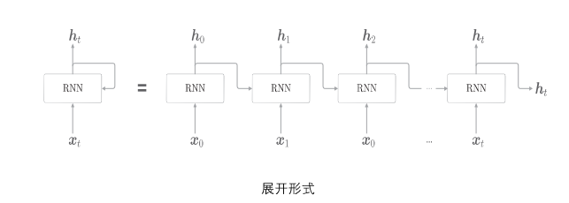

# 基本形式

RNN（循环神经网络）由前馈神经网络发展而来。
RNN通过使用带自反馈的神经元，能够处理任意长度的序列。
图中$h_{t}$是隐藏状态，每一级RNN训练的参数有上一级$h_{t-1}$在输出中的比重$W_{h}$以及本级输入$x_{t}$在输出中的比重$W_{x}$还有偏重b

### 计算公式：
$h_{t} = tanh(h_{t-1}W_{h} + x_{t}W_{x} + b)$

# RNN的不足
1、长程依赖问题：由于梯度消失问题，往往只能学习到短期的依赖关系
2、记忆容量：随着$h_{t}$不断累积存储新的输入信息，会出现信息饱和现象
3、时间序列维度无法并行，效率低 -> 改进：[基本框架——编码器解码器](/posts/ai知识/transformer/)

# 解决方案
引入门控机制来控制信息的累积速度，有选择地加入新的信息，并有选择地遗忘之前累积地信息，称为基于门控地循环神经网络。
[[GRU]]
[工作流程](/posts/ai知识/lstm/)
