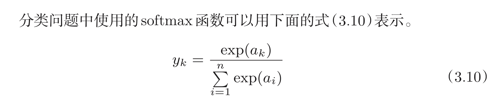
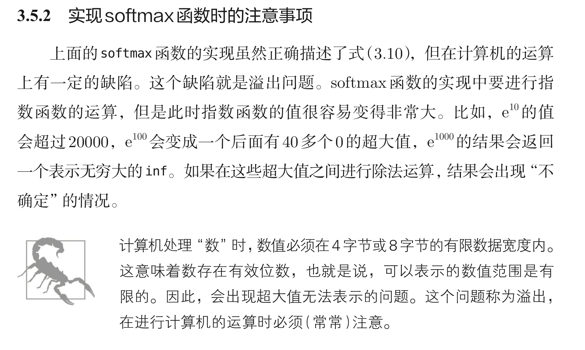
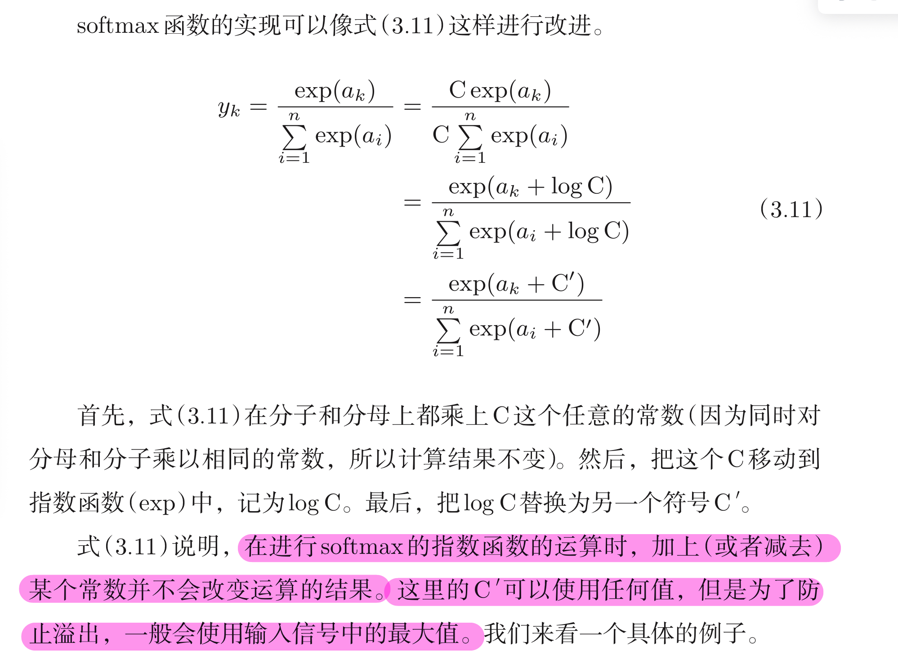

# 定义


# numpy实现

```python
def softmax(a):
	exp_a = np.exp(a)
	sum_exp_a = np.sum(exp_a)
	y = exp_a / sum_exp_a
	return y
```

# 针对溢出问题进行优化




# 溢出优化版numpy实现

```python
def softmax(a):
	c = np.max(a)
	exp_a = np.exp(a-c)
	sum_exp_a = np.sum(exp_a)
	y = exp_a / exp_a
	return y
```
