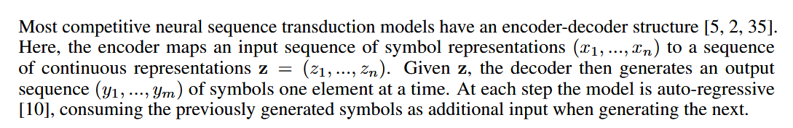
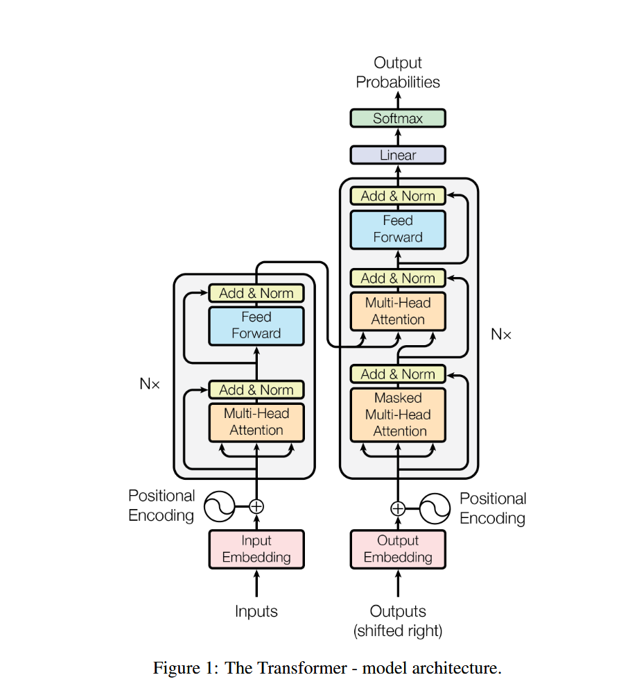
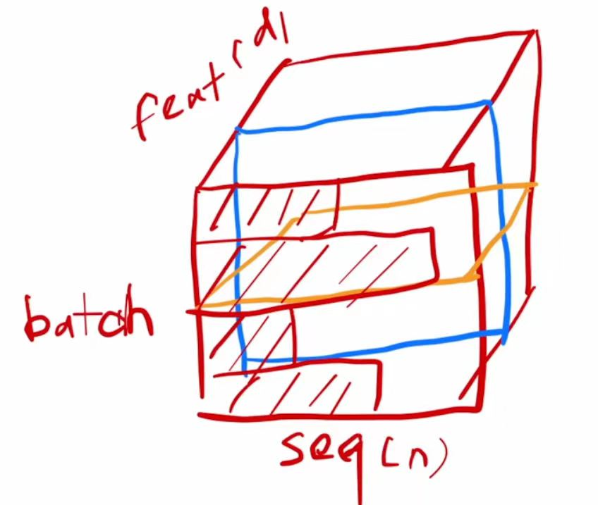
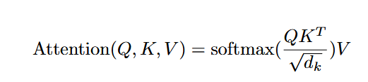
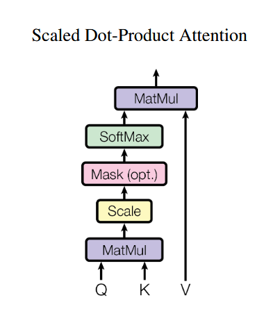
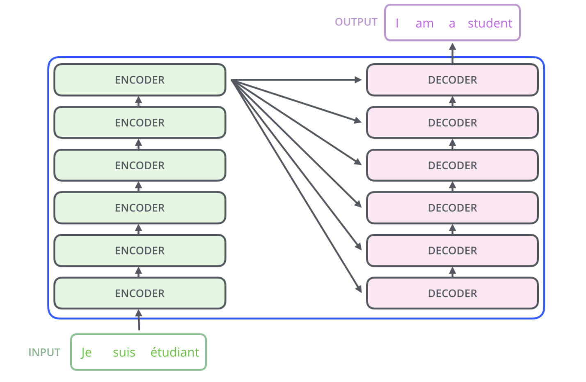
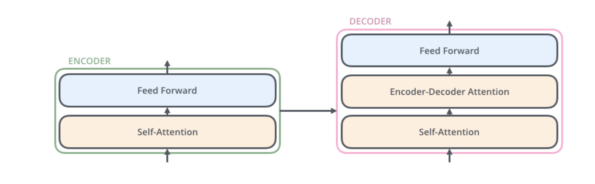
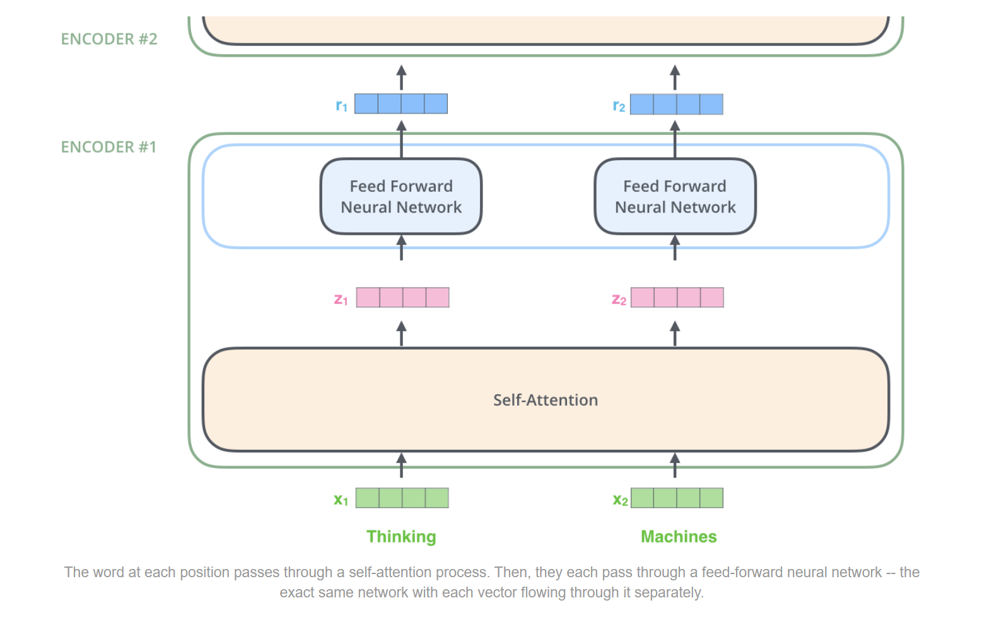
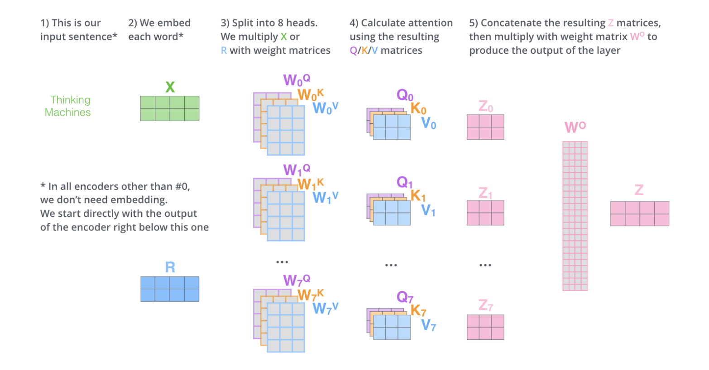

# 基本框架——编码器解码器
编码器（并行）：由$(x_{1},...,x_{n})$得到相同长度的$(z_{1},...,z_{n})$。
解码器（串行，自回归）：由**z**依次生成不同长度的$(y_{1},...,y_{m})$，生成$y_{k}$的时候不仅需要**z**还需要$y_{k-1}$。

# 世界名画

# 为什么使用的是LayerNorm而不是BatchNorm
图中蓝色线是BatchNorm，黄色线是LayerNorm
关键点在于每一个batch的sequence长度可能不同，LayerNorm很好的规避了这个问题
LayerNorm每个样本自己来算均值和方差，不存在全局的均值和方差，相对来说稳定一些

# 为什么解码器中使用masked multihead attention

使用掩码是因为：编码器中所有的输入能同时看到，但是解码器是自回归的，预测t时刻的时候不允许看到t时刻以后的输入，所以用mask(掩码)来隐藏t时刻以后的输入

# 自注意力机制：Scaled Dot-Product Attention（带尺度的内积注意力） MHA

具体做法：
1、Query维度是$(m,d_{k})$，Key维度是$(n,d_{k})$，两者内积得到维度(m,n)
2、（区别于内积自注意力）对内积结果除以$sqrt(d_{k})$，目的是softmax后概率值不会过于集中在某一个样本，导致梯度消失
3、mask：把t时刻以及之后的QKT的值赋一个很小的数，softmax后接近0
4、softmax
5、和Value维度$(m,d_{v})$内积得到结果

# 编码器-解码器结构

论文中使用了六个编码器和六个解码器（六可以替换为其他任何数字）

这是编码器和解码器的具体结构

这是编码器的具体实现原理
