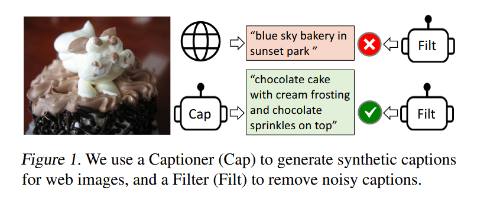
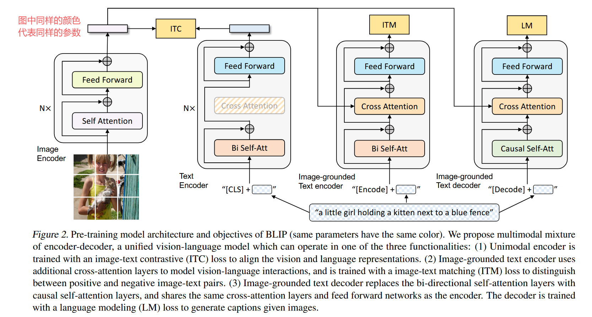
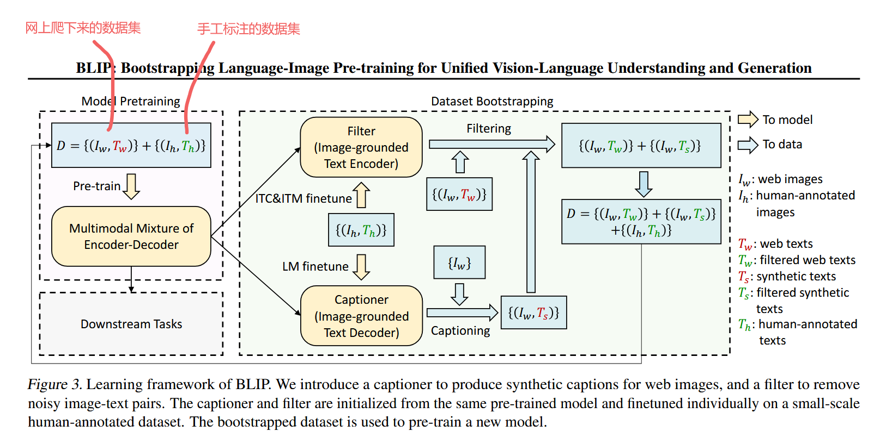
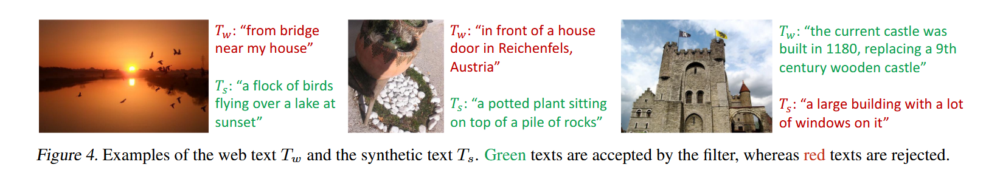

[[BLIP: Bootstrapping Language-Image Pre-training for Unified Vision-Language Understanding and Generation](https://arxiv.org/pdf/2201.12086)]()

BLIP是[ALBEF](/posts/ai知识/多模态/albef/)原班人马做的

# 引言

动机：
1、模型角度:大多数模型要么用transformer encoder的一些模型(CLIP ALBEF),或者用encoder-decoder结构。encoder基础的模型更难使用到文本生成的任务中，因为只有编码器没有解码器。encoder-decoder虽然可以使用到文本生成的任务中，但是模型尚未被成功应用于图像-文本检索任务。所以想一个模型把这两种任务都解决了，也就是BLIP。
2、数据角度:目前先进的模型(CLIP ALBEF SimVLM)都是在网上爬下来的这种noisy的数据上进行预训练的，虽然说有足够多的数据集的时候能弥补一些嘈杂数据集带来的影响，但是这不是最优解。

模型训练了一个Captioner负责为网络图片生成合成的描述，一个Filter负责筛选出描述里面正确的描述。图1中图片原本的描述被Filt判断为不符合描述，图片经过Cap得到的描述被Filet判断为符合的描述。

# 基本架构

作者管这个架构叫MED，全称是Mixture of Encoder and Decoder

我们可以发现BLIP不看最右边计算LM的部分的话和ALBEF还是很像的，区别在于ALBEF文本输入后到ITC前的transformer block数量少于N、BLIP等于N，且BLIP中文本编码器前后共享参数(sa ffn层全是共享参数，第二层只有交叉注意力层需要额外学习)

最右边相当于一个文本的decoder，为了做生成式的任务。训练时把句子后面的部分都mask掉，所以自注意力层用的是因果自注意力。后面交叉自注意力层和前馈层与前面的编码器共享参数，所以参数量并没有增加多少。最后的LM是GPT系列的Language Modeling，也就是说给定一些词，预测剩下的那些词。(注意与MLM的区别，LM更适合生成，MLM更适合理解)

右边三个模型使用的token不一样，第一个模型使用CLS token，第二个模型使用Encode token,第三个模型使用Decode token。这些模型都很难训练，训练成本高。因为每次训练的时候，图像端只需要一次forward,文本端要做三次forward。

# 数据增强bootstrapping

图4是具体举例

