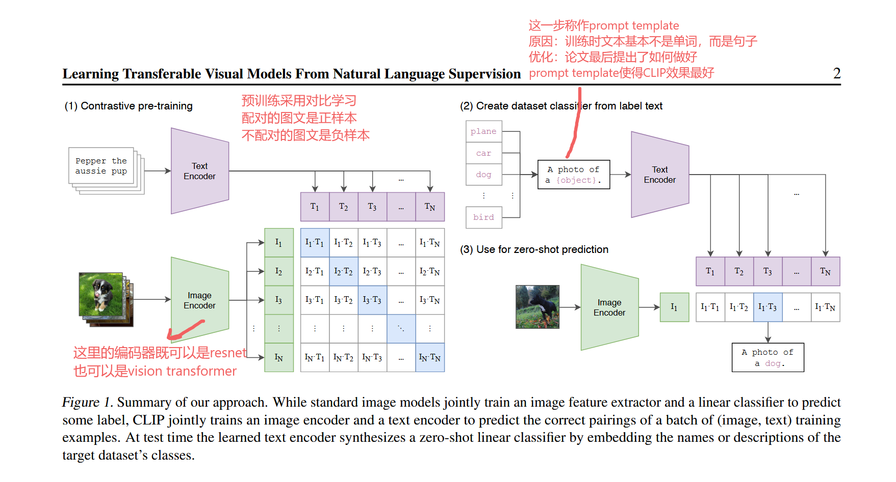
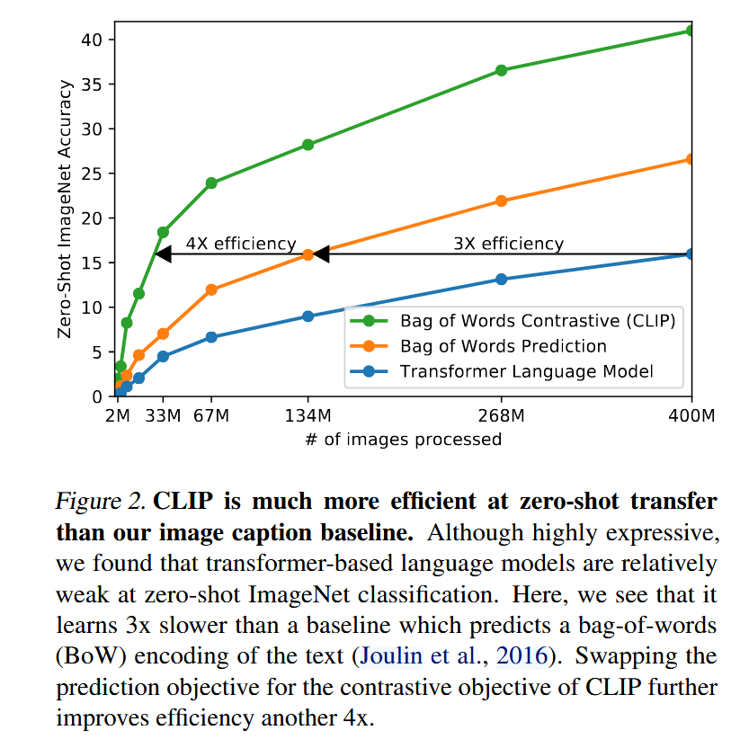
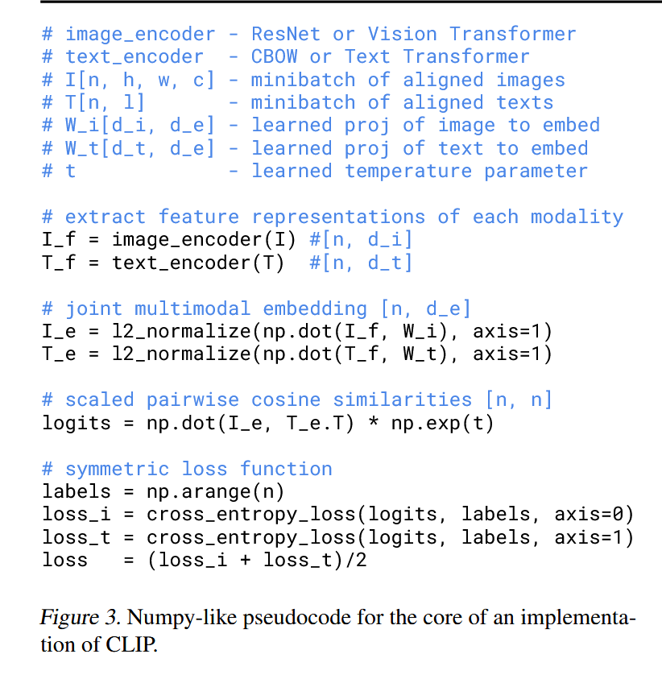
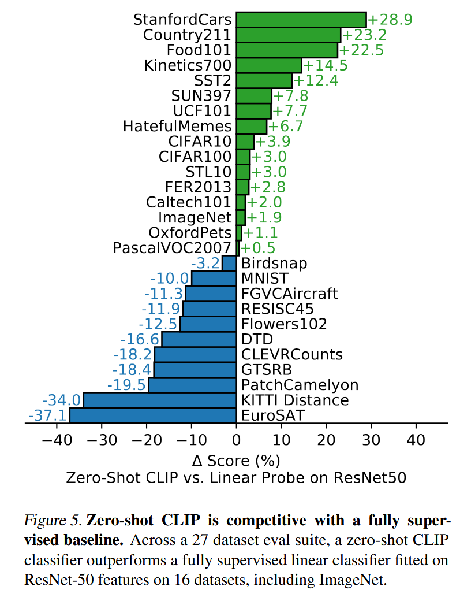
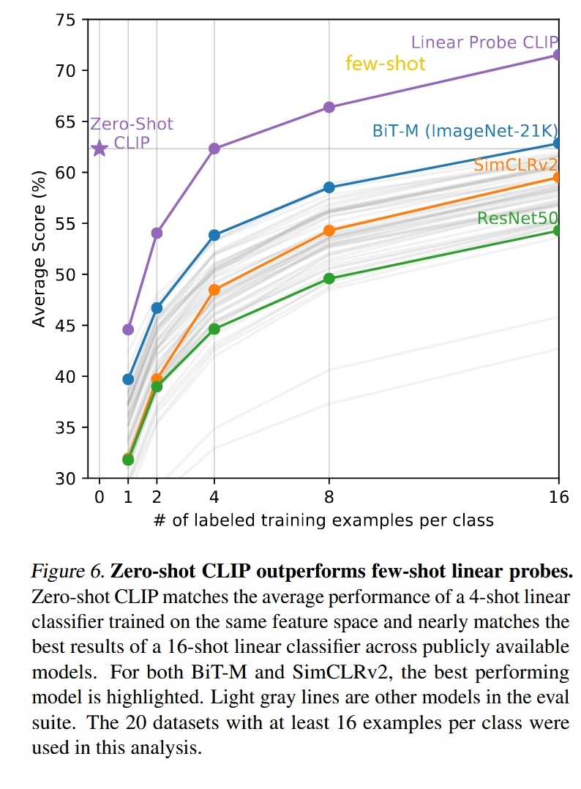

[[Learning Transferable Visual Models From Natural Language Supervision](https://arxiv.org/pdf/2103.00020)]()
论文名:从自然语言监督中学习可迁移的视觉模型

# 基本原理

CLIP是一个典型的双塔模型，一个对应文本，一个对应视觉。对比学习，在特征空间上让同一对的图文拉的尽量近、不是同一对的图文拉的尽量远

双塔模型的优缺点:
- **优点（检索极快）：** 图像和文本的特征提取是完全解耦的。在推理时，可以把几千万张图像的特征提前算好存入向量数据库（如 Faiss）。用户输入文本时，只跑一次文本编码器，然后做点积计算即可，极度适合大规模图文检索任务。
    
- **缺点（缺乏细粒度理解）：** 只有在最后的点积操作才发生模态交互，属于**晚期融合（Late Fusion）**。模型很难进行复杂的视觉-语言推理操作（比如：判断图中红色的车是不是停在树下），因为深层特征没有进行跨模态的交叉注意力计算。

核心思想是从自然语言监督数据中学习感知。这样做有两个好处:1、获取数据集进行预处理更方便，只需要下载图文对，不需要像ImageNet数据集那样子固定N个标签、然后还要对每张图片进行标注了，现在模型的输入和输出自由度也更高；2、对图文对进行对比学习，学习到的是多模态的特征，更适合进行zero-shot的迁移学习

# 摘要

1、当时计算机视觉系统存在局限性:预测物体的类别是固定的。这限制了系统的泛化能力和实用性

2、从图文中直接学习可以利用更大范围的监督数据

3、CLIP使用了4亿个图文对进行预训练。预训练后，我们用自然语言引用已学到的视觉概念（或描述新概念），实现模型零样本转移至后续任务。
当时已经有VirTex,ICMLM,ConVIRT做了和CLIP类似的工作，但是规模量太小了，所以效果不好

4、讲述了CLIP的一些成果，最主要的是在ImageNet上零样本生成的准确率和ResNet-50差不多

# 图2解释了为什么使用对比学习

由图可见，对比学习比gpt等预测模型的zero-shot预测精度提升效率更高

# 图3 CLIP实现的numpy伪代码

这里的温度是对比学习的很重要的一个参数，一般来说都是超参数，但是作者不想要去调这个参数，于是把温度变成了可学习的参数

对于图像 $i$ 和文本 $j$，对比损失的核心逻辑（以图像找文本为例）是：

$$L_{i}^{(I \rightarrow T)} = -\log \frac{\exp(\text{sim}(I_i, T_i) / \tau)}{\sum_{j=1}^N \exp(\text{sim}(I_i, T_j) / \tau)}$$
温度$\tau$ 控制着 Softmax 分布的平滑程度。$\tau$ 越小，分布越尖锐，模型会更关注那些“困难的负样本”（Hard Negatives），但如果数据集中存在噪声（图文不匹配），小 $\tau$ 容易导致模型过拟合噪声；$\tau$ 越大，分布越平滑，区分度变弱。

# Prompt Engineering and Ensembling

这么做的原因:
1、是因为单词具有多义性，比如boxer一个单词在不同的语境下面会有不同的含义，又比如cat和fat cat的语义也是完全不一样的
2、CLIP预训练输入的图文对中文字常常是完整的一句话包含多个特征，不同的分词会产生不同的含义

所以作者使用了提示词模板(prompt template) "A photo of a {label}"。这一步就能在ImageNet上提升1.3%的准确率

以及当你提前知道一些图片相关的信息时，CLIP识别的效果也会更好。比如都是动物的数据集就在prompt后面加"a type of animal"

prompt ensembling就是创造多个prompt template然后对结果取平均。比如CLIP这里对ImageNet使用了80个模板取平均，表现提升了3.5%

# 图5 以ResNet50上的Linear Probe为基线查看zero-shot CLIP的效果

Linear Probe是把模型内部的参数固定、只改变分类头的参数，算是few-shot。

我们可以发现，对物体进行分类这种简单任务，CLIP表现更好。但是对于计数、纹理分类这种更难的任务，CLIP表现可能不如传统方法。作者也在此为CLIP打抱不平，认为这种比较难的任务本身就不适合zero-shot，有点为难人了，应该使用few-shot。

于是作者在图6中佐证了自己的看法:

横坐标是训练样本使用量，为0就是zero-shot

我们读图还可以发现CLIP在zero-shot的效果还比用1-4shot的效果更好

# 局限性

1、CLIP要和现有最好的模型打平手的话，需要1000倍的训练规模

2、还有很多领域CLIP的zero-shot无法胜任，比如区分异常和正常

3、CLIP虽然泛化做的很好，但是如果推理和训练的数据差的特别远，那么CLIP的效果还是会很差

4、CLIP还是只能在你给定的类里面做选择，无法自己生成类别

5、CLIP对数据的使用率还是没有特别高效。解决方法:1、数据增强；2、子监督；3、伪标签

6、数据集质量可以更高，网上趴下来的数据可能带有社会偏见

7、给CLIP提供一些训练样本，CLIP的训练效果反而可能会变差。也就是说few-shot可以更加高效
