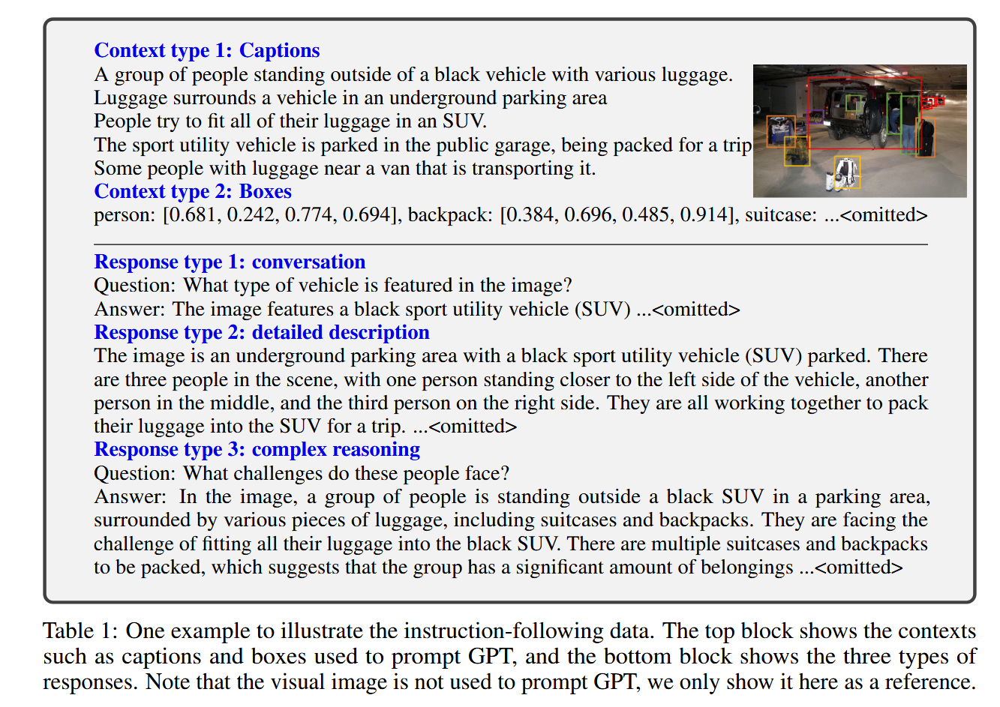
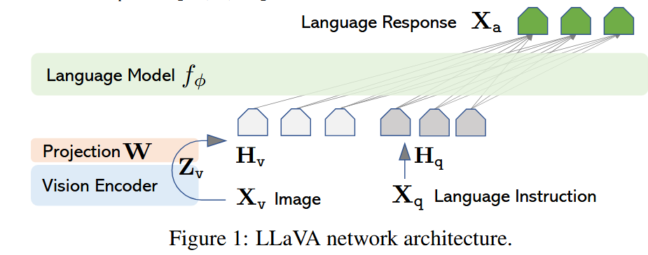

[[2304.08485](https://arxiv.org/pdf/2304.08485)]()

**LLaVA** 代表 **L**arge **L**anguage **a**nd **V**ision **A**ssistant（大型语言与视觉助手）。这个命名不仅呼应了它底层的基座语言模型 LLaMA（实际上 LLaVA 早期版本使用的是基于 LLaMA 微调的 Vicuna 权重），也直接点明了它的使命：连接大型语言模型与视觉模型，打造一个通用的多模态助手 。

### 1. 核心创新：借力 GPT-4 的数据生成 (Section 3)

面试经常会问：在高质量多模态指令数据匮乏的初期，LLaVA 是怎么破局的？

- LLaVA 的破局点在于，首次尝试使用**纯文本的 GPT-4** 来生成多模态的图文指令跟随数据 。
    
- 因为 GPT-4 本身无法直接“看图”，LLaVA 巧妙地将图像转化为了两种符号表示（Symbolic representations）输入给模型：**图像描述 (Captions)** 和 **边界框 (Bounding boxes)** 。
    
- 这种做法成功将图像编码成了大语言模型能够识别的文本序列 。
    
- 基于这些符号化信息，LLaVA 让 GPT-4 生成了三种维度的指令数据：日常对话 (Conversation)、详细描述 (Detailed description) 和复杂推理 (Complex reasoning) 。

下图是个具体例子

**第一阶段：输入特征的映射与对齐**

- **文本流向（$X_q \rightarrow H_q$）**：$X_q$ 代表的是自然语言指令（Language Instruction），也就是用户输入的离散文本 Token（比如 "Describe this image"）。在大语言模型（Vicuna）处理它之前，$X_q$ 必须先经过 LM 自带的**词嵌入层（Word Embedding Layer）**。经过词嵌入矩阵映射后，离散的文本 Token 就变成了连续的词嵌入特征向量，这才是图中的 $H_q$ 。
    
- **视觉流向（$X_v \rightarrow Z_v \rightarrow H_v$）**：图片 $X_v$ 经过 CLIP 视觉编码器提取出视觉特征 $Z_v$ 。随后，通过一个可训练的线性投影矩阵 $W$，将 $Z_v$ 映射为 $H_v$ 。
    
- **对齐的关键点**：投影矩阵 $W$ 的唯一目的，就是强制让视觉 Token $H_v$ 的维度，与语言模型的词嵌入特征 $H_q$ 的维度**完全保持一致**

# 完整工作流

### Phase 1: 数据准备 (Data Generation)

LLaVA 的第一步是解决“缺乏高质量多模态指令数据”的问题。

- **提取纯文本特征**：为了利用纯文本的 GPT-4，LLaVA 先将 COCO 图像转换为两种符号表示：边界框（Bounding boxes）和图像描述（Captions） 。
    
- **GPT-4 扮演老师**：将这些纯文本的符号表示喂给 GPT-4，让它“脑补”出图像画面，并生成三种维度的多模态指令数据：日常对话（Conversation）、详细描述（Detailed description）和复杂推理（Complex reasoning） 。
    
- **产出数据集**：最终生成了总计 158K 的高质量图文指令跟随数据 。
    

### Phase 2: 架构组装 (Architecture Design)

准备好数据后，需要搭建模型骨架。LLaVA 的结构非常清爽，没有引入复杂的模块：

- **视觉感知**：使用预训练的 CLIP (ViT-L/14) 提取图像 $X_v$ 的视觉特征 $Z_v$ 。
    
- **大脑中枢**：选用具有强指令跟随能力的 Vicuna 作为大语言模型 。
    
- **桥梁搭建**：在视觉编码器和语言模型之间，仅仅插入一个简单的可训练线性投影矩阵 $W$ 。这个投影矩阵负责将视觉特征 $Z_v$ 映射为视觉 Token $H_v$，使其与语言模型的词嵌入空间维度保持一致 。

在提取 CLIP 视觉特征时，LLaVA 并没有使用最后一层的特征，而是使用了**最后一层之前的网格特征 (grid features before the last Transformer layer)** 。

- **深层原因**：论文中分析指出，CLIP 最后一层的特征往往更关注全局和抽象的图像属性 。
    
- 相比之下，倒数第二层的特征保留了更多局部的视觉属性，这对于理解特定的图像细节（这正是多模态指令跟随所必需的）更加有用 。
    

### Phase 3: 两阶段训练 (Two-Stage Training)

这是 LLaVA 的核心工程范式，定义了模型如何分步学习：

- **Stage 1：特征对齐预训练 (Pre-training for Feature Alignment)**
    
    - **动作**：严格冻结 CLIP 视觉编码器和 Vicuna 语言模型的权重，**仅训练投影矩阵 $W$** 。
        
    - **数据**：使用经过筛选的 595K 简单的“图像-文本对”（单轮对话） 。
        
    - **目的**：相当于给冻结的语言模型训练一个“视觉分词器”（Visual tokenizer），强行让图像特征映射并对齐到语言模型能理解的词嵌入空间中 。
        
- **Stage 2：端到端微调 (Fine-tuning End-to-End)**
    
    - **动作**：继续冻结 CLIP 视觉编码器，但这次**同时开放投影层 $W$ 和 Vicuna 的权重**进行更新 。
        
    - **数据**：使用 Phase 1 中由 GPT-4 生成的 158K 多模态指令数据 。
        
    - **目的**：全面提升模型在看图聊天、多轮对话和复杂科学问答（如 Science QA）上的多模态指令跟随能力 。
        

### Phase 4: 推理前向 (Inference Flow)

当训练完成后，实际面对用户提问时，它的内部数据流向如下：

- **输入处理**：用户传入一张图片 $X_v$ 和文本指令 $X_q$（例如“这图里有什么不寻常的？”） 。
    
- **特征提取与拼接**：图片通过 CLIP 和投影层变成视觉 Token $H_v$；文本通过词嵌入变成文本 Token $H_q$ 。根据预先设定的格式，将系统提示词、视觉 Token 和文本指令组装成一个统一的长序列 。
    
- **自回归生成**：Vicuna 接收这个拼接好的多模态上下文序列，利用标准的自回归机制（Auto-regressive），逐个 Token 预测并生成最终的自然语言答案 $X_a$ 。

# 缺点

- **“图块袋”效应 (Bag of Patches)**：在某些场景下，LLaVA 会将图像感知为“一块块补丁的集合 (a bag of patches)”，从而未能真正掌握图像内部复杂的语义关系 。例如论文中的测试：当被问及冰箱里是否有草莓味酸奶时，它看到了冰箱里的酸奶和草莓，就会错误地回答“有” 。
    
- **幻觉问题 (Hallucination)**：它继承了基础大语言模型的通病，有时会生成缺乏事实基础或输入数据支撑的输出 。

# 评测创新

传统的分类或检测任务有明确的准度（Accuracy）或 mAP 指标，但像 LLaVA 这样生成开放式自然语言回复的模型，该怎么客观评测呢？

- **引入 GPT-4 作为裁判**：LLaVA 借鉴了语言模型领域的思路，利用纯文本的 GPT-4 来衡量生成回复的质量 。
    
- **打分维度**：GPT-4 裁判会从回复的帮助性（helpfulness）、相关性（relevance）、准确性（accuracy）以及细节丰富度（level of detail）这几个维度进行综合评估，并给出 1 到 10 分的整体评分 。

# 模型融合策略：ScienceQA 上的“专家会诊”(Section 5.2)

在解决多模态科学问答（ScienceQA）数据集时，LLaVA 提出了一种非常有创意的模型集成（Model Ensembling）方案。

- **GPT-4 作为最终法官 (GPT-4 as the judge)**：当 LLaVA 和纯文本的 GPT-4 给出的答案不一致时，他们并没有简单地加权平均，而是把题目以及这两个模型的不同答案再次喂给 GPT-4，让它结合多方意见给出最终答案 。
    
- **效果显著**：这种类似“专家会诊”的集成策略，成功在 ScienceQA 上达到了 92.53% 的全新 SOTA（State-of-the-Art）准确率 。
