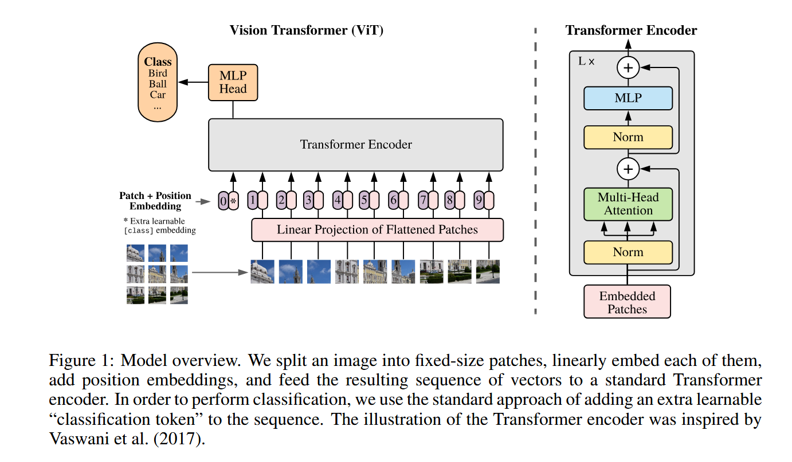
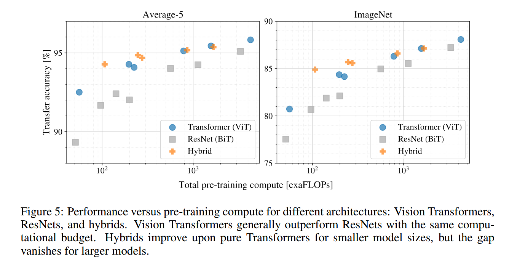
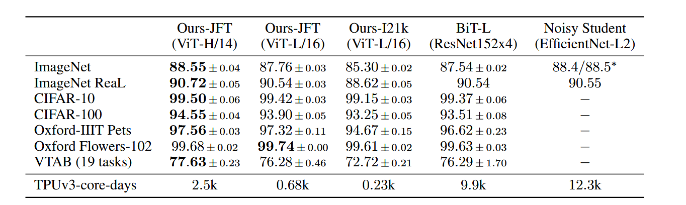
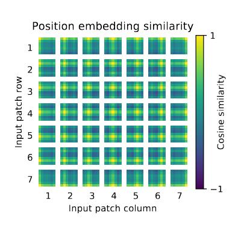

# 地位

1、打通了CV和MLP的鸿沟，颠覆了CV领域CNN的绝对统治，证明了transformer在视觉领域同样符合规模法则
(与以往在计算机视觉中使用自注意力的研究不同，ViT并未在架构中引入图像特定的归纳偏见，除了初始的patch提取步骤。)
2、把图像进行patch，变成和自然语言一模一样的序列，成为跨模态对齐的底座

# patch

把图像打成很多个16 * 16大小的块

# 为什么要patch

输入序列长度为N时，transformer运算复杂度是O($n^2$)级别的。假设你输入的是224 * 224 大小的图片，那么逐个像素加入transformer的话复杂度就来到了 $224 ^ 2 = 50176$级别。用 16 * 16的patch的话最后计算复杂度就降到了$14 ^ 2 = 196$级别。

# 图1:架构图

自注意力是所有的元素之间两两去做交互，本身并不存在顺序问题。但是对于图片来说它是一个整体，所以给patch embedding加上position embedding。这样整体的token既包含了这个图片块原本有的图像信息，又包含了图像块所在的位置信息。

随后会经过一个线性投影层(可以用E表示)，将每一个patch的维度投影成transformer的输入维度。

得到一个一个的token后就和transformer一样了，把它输入进transformer encoder，transformer会反馈出很多输出。

问题:这么多输出，拿哪个去做分类呢？

借鉴BERT的分类字符cls(extra learnable embedding)，这里我们也加了这样的字符、图中用 * 代替、而且也加了position embedding。因为所有token都两两交互，所以他们相信这个cls能从别的embedding里面学到有用的信息，从而我们只需要根据它的输出做一个最后的判断就可以。

MLP Head就是一个通用的分类头，最后用交叉熵函数去进行模型的训练。

预处理举一个具体的例子，假如我们输入的图片大小224 * 224 * 3，patch大小16 * 16 * 3 = 768(记作D)。那么我们会得到196个768维的patch。经过768 * 768的线性投影层后依旧是196个768维的patch。表头还有个1 * 768的cls，总共有197个768维的patch。position embedding是一张可学习的表(和BERT相同)，每个位置都有768维(和D大小一样)向量，和对应位置的patch逐元素相加。然后整体送入transformer encoder。

layernorm不改变维度大小。在MHA中，假设有12个头，那么embedded patches首先分别和768 * 768的wq wk wv矩阵相乘得到197 * 768的k q v矩阵，每个头分别是197 * 64的q k v，分别算自己的输出197 * 64，最后拼接起来重新变回197 * 768。MLP中一般来说维度先翻4倍再降维回去，中间维度197 * 3072，输出197 * 768。

有L层transformer block，不改变维度大小。

# 归纳偏置

Vision Transformer的图像特异性归纳偏置远低于CNN。在CNN中，局部性、二维邻域结构和平移等差性被嵌入整个模型的每一层。在ViT中，只有MLP层是局部且平移等变的，而自注意层是全局的。二维邻域结构的使用非常节约：在模型初期通过将图像切割成片段，以及在微调阶段调整不同分辨率图像的位置嵌入。除此之外，初始化时的位置嵌入不包含patch的二维位置信息，所有patch间的空间关系都必须从零学习。

# 混合架构

我们可以不用patch，而是训练一个CNN得到对应大小的patch。其他步骤不变。

在较小数据集上面，混合架构Hybrid效果最好、ViT其次、resnet最差。在大数据集上面，前两者的效果差不多(本文作者没解释原因)。如下图

# 微调(局限性)

理论上来讲，ViT可以输入任意大小的图片，但是保持patch size不变的话，序列长度会变化(也就是patch的数量会变化)，原来训练的位置编码就可能失效了，位置编码是有明确的位置信息在里面的。一种临时的解决方案是使用二维插值，但是会有损失。这是ViT微调部分的局限性。

# 模型分类

ViT 分为 ViT-Base ViT-Large ViT-Huge。
比方说ViT-L/16表示ViT-Large输入patch为 16 * 16.
patch越小，数量越多，模型相对越贵。

# 结果对比

具体指标差不多，但是训练成本(最下面一行可以看到)ViT低的多。

作者还做了位置编码两两patch的余弦相似度，我们可以看到这个1维编码已经学习到了很多2维的位置信息，也就说明了为什么1维编码和2维编码效果差不多。

# 挖的坑

从任务角度来说，ViT只做了图像分类，还有图像检测、图像分割有待探索。

从改变结构的角度来说，可以改刚开始的tokenization，可以改中间的transformer block。
