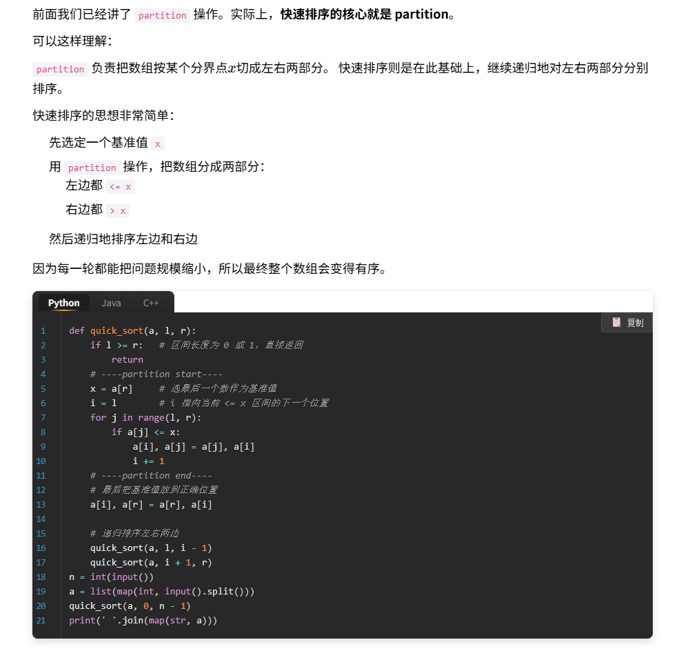
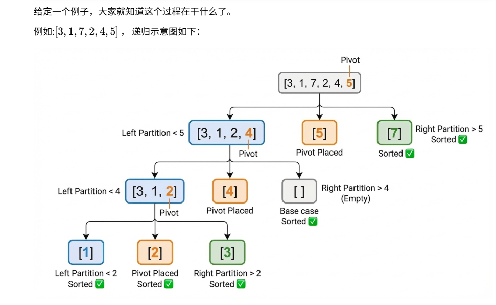

快速排序中的"partition"操作:给定一个数组和一个分割点, **原地**将这个数组分成左右两个区域，前面的数≤x , 后面的数>x

例如[3,1,7,4,5],x=4 , 输出[3,1,4 ∣ 7,5]

[5,8,7,1,2],x=4 , 输出[1,2 ∣ 5,8,7]

考虑将所有小于等于x的数视作非零数 ，大于xx的数视作零，该问题转化为移动零问题
[leetcodehot100-283.移动零](/posts/python/双指针/leetcodehot100-283-移动零/)

```python
num, x = map(int, input().split()) 
a = list(map(int, input().split())) 
i = 0 # i 指向当前 <= x 区间的下一个位置 
for j in range(num): 
	if a[j] <= x: # 唯一区别。。。 
	a[i], a[j] = a[j], a[i] 
	i += 1 
print(' '.join(map(str, a)))
```

