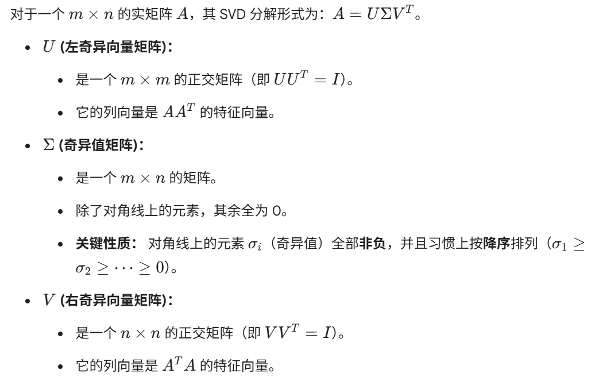
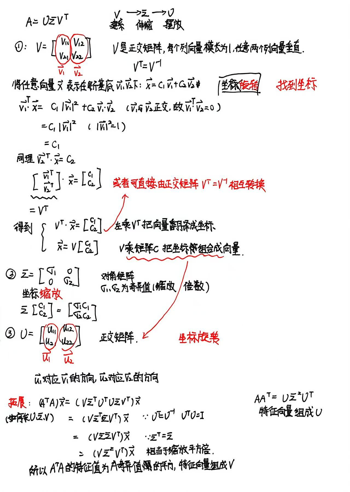
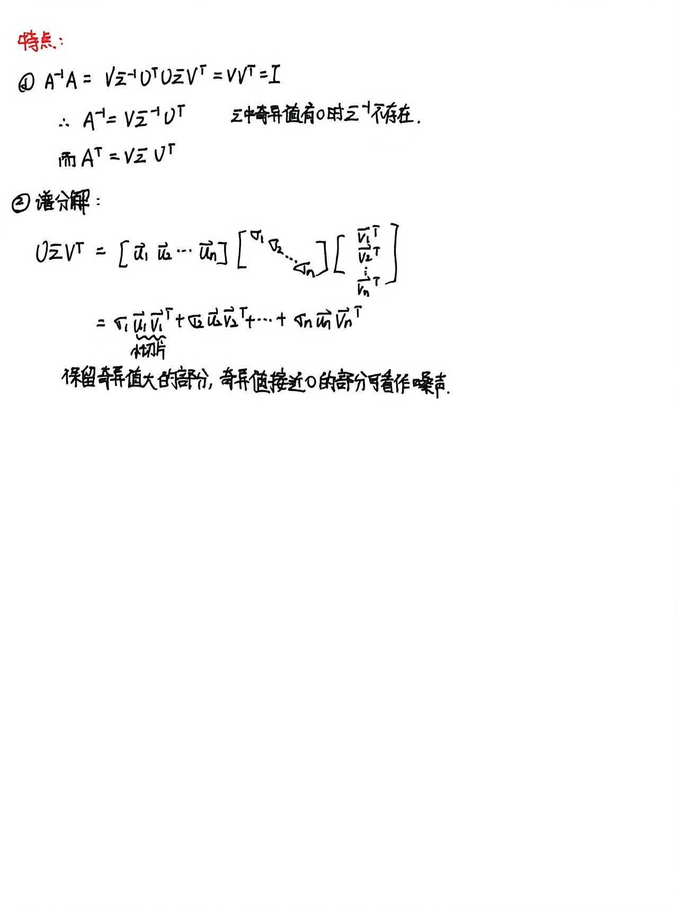

推荐学习视频:
[https://www.bilibili.com/video/BV1XcfiBeEwQ/?spm_id_from=333.1391.0.0]()

# 学习笔记(基于上述视频)

**Frobenius 范数**：$\|A\|_F = \sqrt{\sum \sigma_i^2}$
[Frobenius范数](/posts/线性代数/frobenius范数/)

秩=非零奇异值的个数(零奇异值相当于该维度被压缩为0了)
