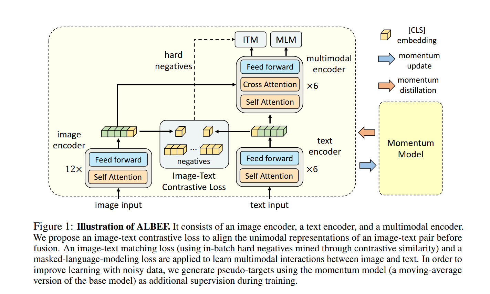
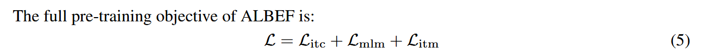
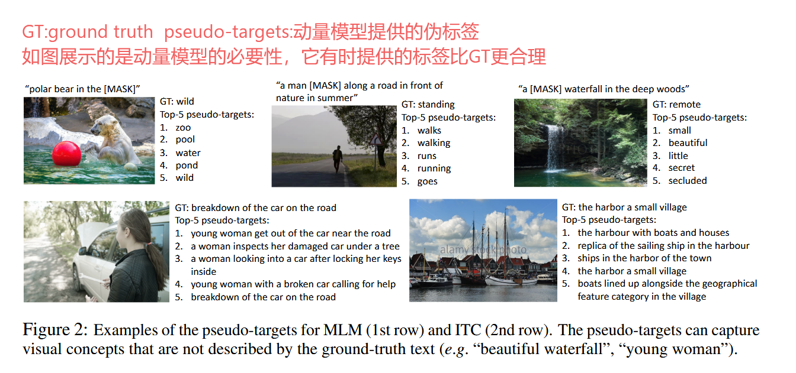

[[2107.07651](https://arxiv.org/pdf/2107.07651)]()
Align before Fuse: Vision and Language Representation Learning with Momentum Distillation

# 基本架构

符合[图2 目前视觉-语言多模态模型参数量分配](/posts/vilt/)中的结论:

1、我们可以发现ALBEF的VE(Visual Embedder)由12个transformer block组成，TE(Texual Embedder)由6个transformer block组成，VE比TE更复杂。

2、相对于[基本原理](/posts/clip/)中MI(Modality Interaction)仅仅是点乘，ALBEF使用了六层的transformer block。

3、目标函数使用了ITC Loss(Image-Text Contrastive Loss)、ITM Loss(Image-Text Matching Loss)、MLM(Mask Language Modeling)

ITC也就是CLIP Loss，作用在单模态编码器的输出上，负责拉近正样本对的距离，属于粗粒度对齐。

ITM相当于是一个二分类，判断图文匹配不匹配很容易、因为负样本占大头，这样会导致训练很快收敛。为了解决这个问题，我们先对图片emb和文字emb进行了ITC Loss的计算，把Loss最小的两项输入ITM，即正样本以及和正样本最近的一个负样本(这个方法称作Hard Negative Mining)。这里用的是没有mask的text input。

MLM就是BERT里面做的完形填空，随机 Mask 掉文本中的一些单词，让模型同时结合图像信息和剩余文本去预测这些词，增强模型的跨模态推理能力。这里用的是mask后的text input

# 摘要

1、ALBEF使用了CLIP里面的contrastive loss

2、从网上爬下来的图文对都是alt text，文本不一定是图片中的关键特征，具备搜索属性、但是可能不具备很好的描述属性，作者称之为noisy web data。为了克服noisy web data，作者提出了一个用动量模型(momentum model)去生成伪标签(pseudo target)，从而实现对noisy web data的自训练。

# 动量蒸馏

网络爬取的图文数据存在大量噪声（Weakly-correlated）。比如一张图是猫，文本却是“这是我今天买的猫粮”。如果用 One-hot 的硬标签去算 Loss，模型会很困惑。ALBEF 维护了一个动量更新的 Teacher 模型，Teacher 模型会输出一个连续的概率分布（Soft labels）。Student 模型不仅要拟合真实的硬标签，还要去拟合 Teacher 的软标签。这样即使图文不绝对匹配，模型也能学到它们之间潜在的语义联系。

我们只对ITC和MLM进行动量蒸馏，不对ITM进行，因为ITM是二分类任务、只需要GT。
