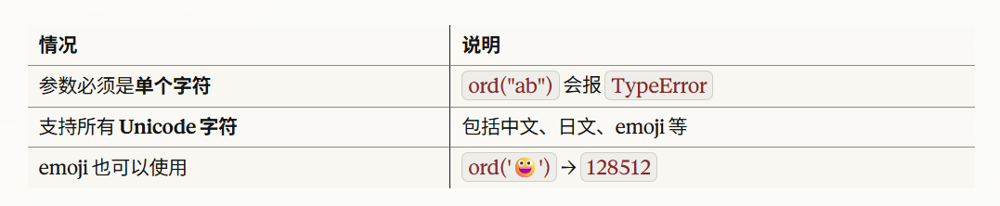

`ord()` 是 Python3 的内置函数，用于**将单个字符转换为其对应的 Unicode 码点（整数）**。

# 语法
```python
ord(c)
```
- **参数**：`c` —为一个长度为 1 的字符串（单个字符）
- **返回值**：该字符对应的 Unicode 整数值

# 基本用法

```python
# ASCII 字符
print(ord('A'))    # 输出: 65
print(ord('a'))    # 输出: 97
print(ord('0'))    # 输出: 48
print(ord(' '))    # 输出: 32（空格）

# 中文字符
print(ord('你'))   # 输出: 20320
print(ord('好'))   # 输出: 22909

# 特殊字符
print(ord('!'))    # 输出: 33
print(ord('\n'))   # 输出: 10（换行符）

```

# 与[与[[ord]]关系](/posts/chr/)的关系
ord()与chr()是互为逆运算的一对函数：


# 注意事项


