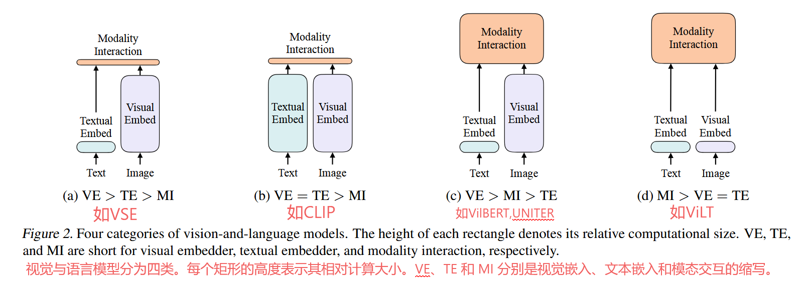

[[ViLT: Vision-and-Language Transformer Without Convolution or Region Supervision](https://arxiv.org/pdf/2102.03334)]()
# 图2 目前视觉-语言多模态模型参数量分配

ViLT将VE和TE都变得很简洁，但是MI(多模态融合)部分还是比较复杂的，不然的话两个模态的数据融合不了

这样做的缺点:
1、性能不够高，在很多任务中比不过c类
2、虽然推理时间很快，但是训练时间非常的慢

多模态理想情况下应该像c一样，VE部分和MI部分尽量大，TE部分可以小。VE采用VIT的时候比较复杂，不要用一个简单的patch embedding(d就这么干了)

由此分析我们引出了[基本架构](/posts/albef/)
