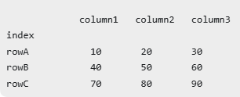

你可以把 Pandas 的 DataFrame 理解成 Excel 表：

它有三个核心部分：

df.index # 行名 
df.columns # 列名 
df.values # 真正的数据区域

# sep/delimiter:分隔符

指定每一列之间用什么分隔

sep = ","逗号分隔
sep = " "空格分隔
sep = r"\s+"不定长空白分隔
sep = "\t" tab分隔

# header:第几行当列名

默认header=0表示第一行为列名

header = None则列名自动生成0，1，2，...

# names:手动指定列名

有表头的时候则覆盖列名

# index_col:指定哪一列作为行索引

默认情况自动生成行索引:0,1,2,3...
也可以按列名指定

# skiprows:跳过前几行或指定行

行号从0开始
